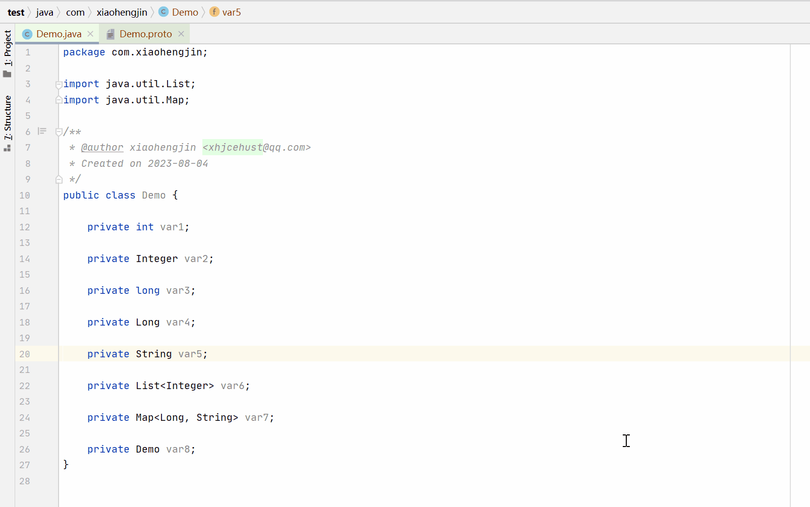

# Pojo2proto

an idea plugin to convert java pojo to proto in IntelliJ IDEA

This plugin generates google protobuf message from right click in a java pojo class file.

choose [PojoProto], The output proto code is copied to the clipboard.

# Screenshot

## Update

* 1.0.0 - First version, support universal pojo type
* 1.0.1 - fix some description about this plugin
* 1.0.3 - Support for enums

## Plugin

https://plugins.jetbrains.com/plugin/14691-pojo-to-proto

# Contact
For any question, just contact me at any time.

mailto: xhjcehust@qq.com

Any suggestion is welcome!
